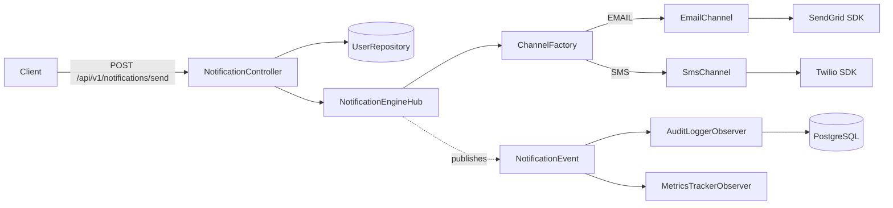

# 📬 Multi-Platform Notification Engine

A Spring Boot backend that sends notifications over **Email** and **SMS** through a single, unified API — built around clean object-oriented design so that adding a new channel (WhatsApp, Push, Slack, whatever's next) never means touching existing code.


---

## Table of Contents

- [What this project does](#what-this-project-does)
- [Architecture & design patterns](#architecture--design-patterns)
- [Tech stack](#tech-stack)
- [Project structure](#project-structure)
- [Getting started](#getting-started)
- [API reference](#api-reference)
- [Database schema](#database-schema)
- [CI/CD](#cicd)
- [Roadmap & honest notes](#roadmap--honest-notes)
- [License](#license)

---

## What this project does

You send one HTTP request with a username, a channel (`EMAIL` or `SMS`), and a message. The engine looks up the user, hands the message to the right delivery channel, logs the outcome to PostgreSQL, and fires off metrics — all without the controller or the core logic ever knowing *how* an email or SMS actually gets sent under the hood.

It's a small project, but it's deliberately over-engineered in the *good* way — the kind of codebase that's meant to demonstrate how a notification system at an actual company might be structured, rather than just "make it work."

## Architecture & design patterns

The whole point of this codebase is the plumbing, so here's how the pieces fit together:



**Factory Pattern — `ChannelFactory`**
Spring collects every `NotificationChannel` bean into a `Map<String, NotificationChannel>`, keyed by bean name (`EMAIL`, `SMS`). The factory just does a lookup on that map. Want to support WhatsApp tomorrow? Write `WhatsAppChannel implements NotificationChannel`, annotate it `@Component("WHATSAPP")`, and you're done — no edits to the factory, the hub, or the controller.

**Strategy Pattern — `NotificationChannel`**
`EmailChannel` and `SmsChannel` are interchangeable strategies for "how do I deliver this message." The rest of the app depends only on the interface, never on a concrete channel.

**Adapter Pattern — the channel classes wrapping vendor SDKs**
`ThirdPartySendGridApi` and `ThirdPartyTwilioApi` don't agree on anything — one returns an HTTP status code, the other returns `void`. `EmailChannel` and `SmsChannel` absorb that inconsistency and expose one clean `boolean send(...)` contract to the rest of the system.

**Observer Pattern — Spring's event system**
`NotificationEngineHub` publishes a `NotificationEvent` after every send attempt and doesn't care who's listening. `AuditLoggerObserver` persists the attempt to `notification_logs`; `MetricsTrackerObserver` logs counters. Both react independently, and a third observer could be dropped in without touching the hub at all.

**Centralized validation & error handling**
`NotificationRequest` leans on Jakarta Bean Validation (`@NotBlank`, `@Pattern`) so bad input never reaches business logic, and `GlobalExceptionHandler` turns validation failures and lookup errors into consistent JSON responses instead of stack traces.

## Tech stack

| Layer | Choice |
|---|---|
| Language | Java 17 |
| Framework | Spring Boot 4.1.0 (Web MVC, Validation, Data JPA) |
| Database | PostgreSQL 15 |
| ORM | Hibernate / Spring Data JPA |
| Boilerplate reduction | Lombok |
| Build | Maven (wrapper included, no local install needed) |
| Containerization | Docker (multi-stage build) + Docker Compose |
| CI | GitHub Actions |

## Project structure

> **Note:** the actual Maven project sits two folders deep, at `demo/demo` — a leftover from how Spring Initializr scaffolds things. Every command below assumes you're inside that folder.

```
demo/demo/
├── src/
│   ├── main/
│   │   ├── java/com/example/demo/
│   │   │   ├── channel/          # Strategy + Adapter: one class per delivery channel
│   │   │   │   ├── NotificationChannel.java
│   │   │   │   ├── EmailChannel.java
│   │   │   │   ├── SmsChannel.java
│   │   │   │   └── ChannelFactory.java
│   │   │   ├── controller/       # REST entry point
│   │   │   │   └── NotificationController.java
│   │   │   ├── core/             # Orchestration layer
│   │   │   │   └── NotificationEngineHub.java
│   │   │   ├── dto/              # Request payload + validation rules
│   │   │   │   └── NotificationRequest.java
│   │   │   ├── event/            # Observer pattern payload
│   │   │   │   └── NotificationEvent.java
│   │   │   ├── exception/        # Centralized error handling
│   │   │   │   └── GlobalExceptionHandler.java
│   │   │   ├── model/            # JPA entities
│   │   │   │   ├── User.java
│   │   │   │   ├── NotificationLog.java
│   │   │   │   └── NotificationTemplate.java
│   │   │   ├── observer/         # Observer pattern listeners
│   │   │   │   ├── AuditLoggerObserver.java
│   │   │   │   └── MetricsTrackerObserver.java
│   │   │   ├── repository/       # Spring Data JPA repositories
│   │   │   │   ├── UserRepository.java
│   │   │   │   └── NotificationLogRepository.java
│   │   │   ├── sdk/              # Mock third-party vendor SDKs
│   │   │   │   ├── ThirdPartySendGridApi.java
│   │   │   │   └── ThirdPartyTwilioApi.java
│   │   │   └── DemoApplication.java
│   │   └── resources/
│   │       └── application.properties
│   └── test/java/com/example/demo/
│       └── DemoApplicationTests.java
├── docker-compose.yml    # spins up PostgreSQL for local dev
├── Dockerfile            # multi-stage build for the app itself
├── pom.xml
├── mvnw / mvnw.cmd
└── .github/workflows/deploy.yml   # CI build pipeline
```

## Getting started

### Prerequisites

- Java 17+
- Docker & Docker Compose (easiest way to get PostgreSQL running)
- No need to install Maven — the wrapper (`mvnw`) handles that

### 1. Clone and move into the project root

```bash
git clone <your-repo-url>
cd Java_Project-main/demo/demo
```

### 2. Start PostgreSQL

```bash
docker-compose up -d
```

This brings up Postgres on `localhost:5432` with database `notification_engine`, user `engine_user`, and password `engine_password` — which already match the defaults in `application.properties`, so there's nothing else to configure for local development.

### 3. Run the application

```bash
./mvnw spring-boot:run
```

On Windows, use `mvnw.cmd spring-boot:run` instead. The API comes up at `http://localhost:8080`, and Hibernate auto-creates the tables on first run (`spring.jpa.hibernate.ddl-auto=update`), so there's no manual schema step.

### Alternative: run the app in Docker too

```bash
docker build -t notification-engine .
docker run --network=<compose-network-name> -p 8080:8080 \
  -e SPRING_DATASOURCE_URL=jdbc:postgresql://notification_db:5432/notification_engine \
  notification-engine
```

Run `docker network ls` after `docker-compose up` to confirm the network name Compose generated — it depends on your folder name.

## API reference

### `POST /api/v1/notifications/send`

**Request body**

| Field | Type | Rules |
|---|---|---|
| `username` | string | required, must match an existing user |
| `channelType` | string | required, must be exactly `EMAIL` or `SMS` |
| `message` | string | required |

**Example request**

```bash
curl -X POST http://localhost:8080/api/v1/notifications/send \
  -H "Content-Type: application/json" \
  -d '{
        "username": "praveen_23",
        "channelType": "EMAIL",
        "message": "Your order has shipped!"
      }'
```

**Success — `200 OK`**

```json
{
  "status": "SUCCESS",
  "message": "Notification delivered and logged successfully."
}
```

**Delivery failure — `500 Internal Server Error`**

```json
{
  "status": "FAILED",
  "message": "Delivery system failure. Check database tracking stack trace logs."
}
```

**Validation error — `400 Bad Request`**

```json
{
  "channelType": "Channel type must be either EMAIL or SMS"
}
```

**Unknown user or channel — `404 Not Found`**

```json
{
  "error": "User matching username 'ghost_user' does not exist."
}
```

Every attempt — successful or not — gets written to `notification_logs` by `AuditLoggerObserver`, so you have a full audit trail regardless of outcome.

## Database schema

**`users`**

| Column | Type | Notes |
|---|---|---|
| `id` | `BIGINT` (PK) | auto-generated |
| `username` | `VARCHAR` | unique |
| `email` | `VARCHAR` | unique |
| `phone_number` | `VARCHAR` | unique |

**`notification_logs`**

| Column | Type | Notes |
|---|---|---|
| `id` | `BIGINT` (PK) | auto-generated |
| `user_id` | `BIGINT` (FK) | references `users.id` |
| `channel_type` | `VARCHAR` | `EMAIL` or `SMS` |
| `sent_content` | `VARCHAR(1000)` | the message body |
| `status` | `VARCHAR` | `SUCCESS` or `FAILED` |
| `failure_reason` | `VARCHAR` | nullable |
| `created_at` | `TIMESTAMP` | set automatically via `@PrePersist` |

**`notification_templates`** *(modeled, not yet wired into the API — see [Roadmap](#roadmap--honest-notes))*

| Column | Type | Notes |
|---|---|---|
| `id` | `BIGINT` (PK) | auto-generated |
| `template_key` | `VARCHAR` | unique, e.g. `WELCOME_TXT` |
| `content` | `VARCHAR(1000)` | placeholder text, e.g. `"Hello {name}, your code is {otp}."` |

## CI/CD

`.github/workflows/deploy.yml` runs on every push and pull request to `main`: it checks out the code, sets up JDK 17, and builds the project with Maven (`mvn -B package -DskipTests`). It's a build-verification pipeline today — nothing gets deployed anywhere automatically yet.

## Roadmap & honest notes

A few things worth knowing if you're picking this project up:

- **Templates aren't hooked up yet.** `NotificationTemplate` exists as an entity, but nothing reads from it. A natural next step is a `/templates` endpoint or having `NotificationEngineHub` resolve `{placeholders}` before sending.
- **Only two channels exist today** (`EMAIL`, `SMS`), even though the design is built to make a third one a small, isolated addition.
- **`docker-compose.yml` only provisions PostgreSQL**, not the app itself. Adding a second service that points at the existing `Dockerfile` would make `docker-compose up` a true one-command start.
- **Credentials in `application.properties` are hardcoded** for local-dev convenience. Swap these for environment variables (or a secrets manager) before this goes anywhere near production.
- **Test coverage is currently just a Spring context-load smoke test.** Unit tests for `ChannelFactory` and `NotificationEngineHub`, plus a `@WebMvcTest` for the controller, would be the logical next addition.

None of these are blockers — they're just the edges of a project that's clearly built to showcase architecture over feature completeness.

## License

No license file is currently included. If you plan on sharing this repository publicly, consider adding one (MIT is a common, permissive default for portfolio projects) so it's clear how others can use the code.
